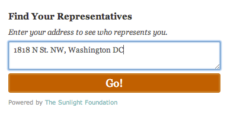

# Find Your Rep Widget

A Basic jQuery plugin that renders a form into the specified target, geocoding
input and displaying results from Sunlight's Congress and Open States APIs.

## Usage:

1. Link jQuery and `dist/jquery.findyourrep-pack.min.js` on your page (in that order).
2. Call `findYourRep()` on an element:

```javascript
    $('.myDiv').findYourRep({
        apikey: 'your-key'
    });
```

## Options:

Passed as a javascript object to the constructor, just like any jQ plugin.

- `apikey`: Your Sunlight Labs API key (required)
- `apis`: A comma-delimited list of apis to query.  
          For U.S. Congress only, use `apis: 'congress'`  
          For U.S. and State Legislatures, use `apis: 'congress, openstates'`  
          Default is `'congress, openstates'`.
- `title`: The title of the widget. Default is 'Find Your Representatives'
- `text`: The text that displays above the textarea for the user's address.  
          Default is 'Enter your address to see who represents you.'
- `action`: The text of the button that finds your reps. Default is 'Go!'

## Default Styles:

There's an included stylesheet which you can add to your page to add some basic style.

By default, all CSS is scoped to a container classname, `.fyr-container`. There's a scss source file
available in the `src/css` folder which you can edit to add your own style.

**Screenshots:**




## Caveats

- The Open States API does not support HTTPS, so queries to it will not be made when
    the embedding page is viewed securely.

## Contributing:

1. Fork this repo
2. Install Node.js if you don't have it
3. Run `npm install && bower install && grunt demo`
4. Commit your changes and send a pull request

## License:

[BSD3](LICENSE)
